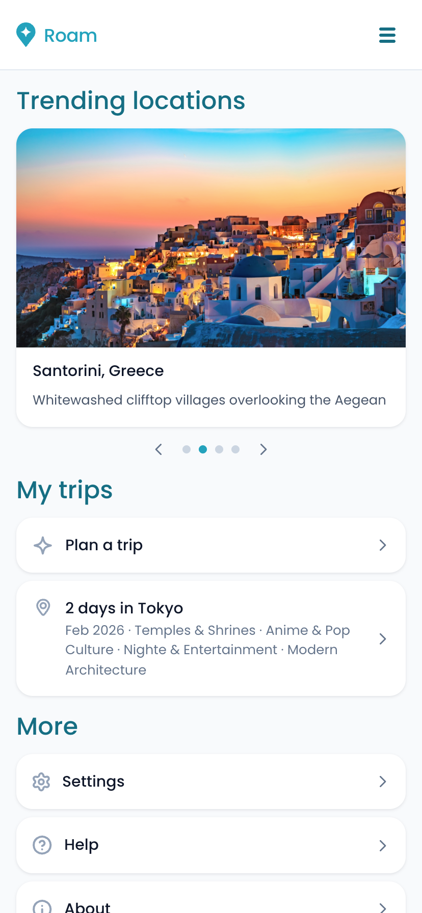
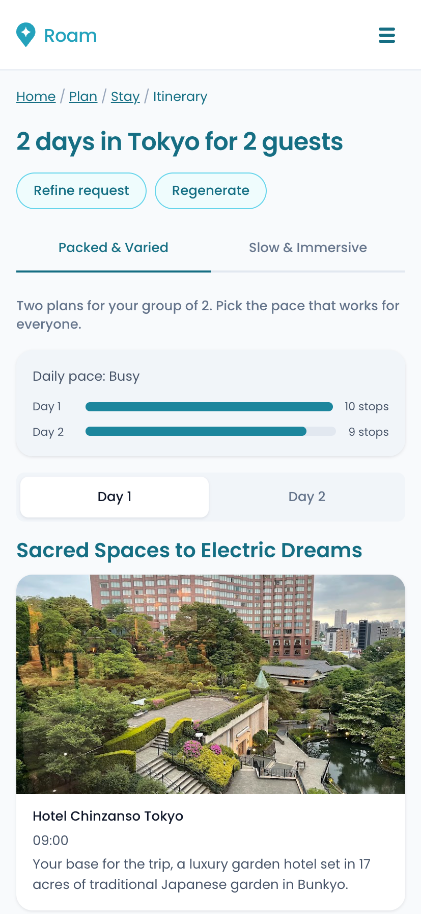
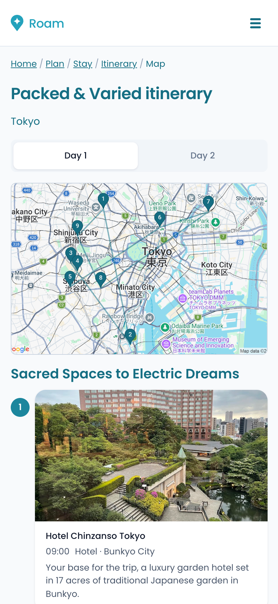
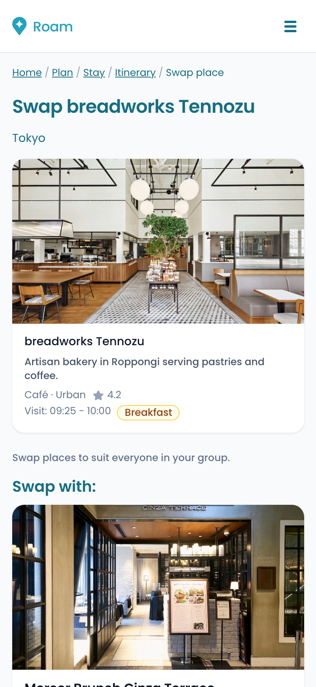
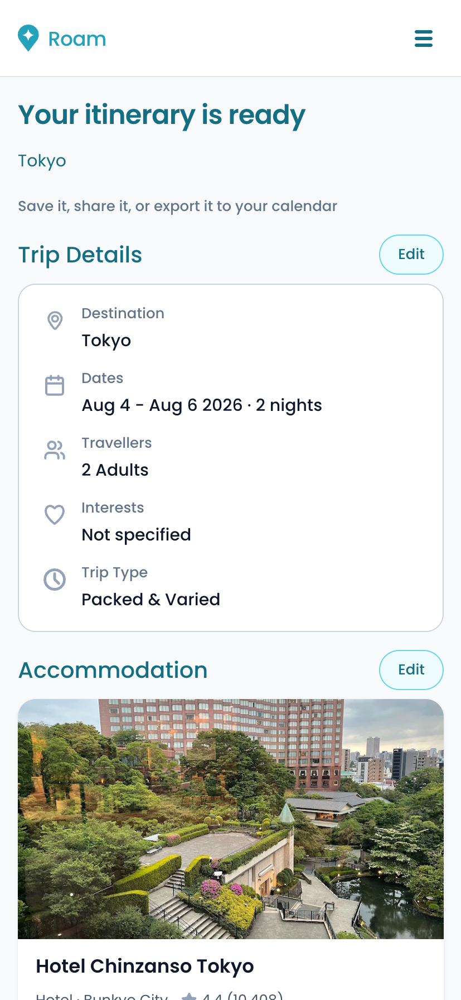

# Roam

An AI trip planner that only suggests places that actually exist.

Live: https://roam-trip-planner.vercel.app

## What it is

Roam plans a trip from a few inputs. You give it a place, start and end dates, a
budget and what you're into. It hands back two full itineraries to compare, side
by side. One is packed and varied. The other is slow and immersive. You pick the
one you like, swap out anything you don't, and save it.

I designed and built the whole thing on my own. Research, the design system, the
front end and the back end.

## The problem I wanted to fix

Most AI planners share the same flaw. They sound confident, then send you to a
restaurant that shut two years ago, or a viewpoint that's a three hour drive from
everything else. The words read well. The plan falls apart.

So Roam doesn't trust the model. Every place the AI suggests gets checked against
Google before it reaches you. If it can't be verified, it gets replaced. If a
stop is more than an hour's drive from the last one, it gets swapped for
something closer. The schedule is rebuilt around real travel times, not guesses.

That's the part I care about. The AI writes a first draft. The app does the fact
checking.

## What it does

- Two itineraries per trip, packed and slow, made in parallel so you can compare them
- Every place verified against Google Places, with the real name, address, rating and photo
- Travel times between stops from Google Routes, with a one hour drive cap per day
- Meal times kept sensible, so breakfast, lunch and dinner land in real windows and not at 3pm
- Swap any stop for a nearby option, and the day reschedules itself in the background
- Accommodation options grouped by budget
- Save a trip and come back to it later
- A map view for each day

## How it's built

- Front end: React 19 and Vite, with react-router
- Back end: serverless functions on Vercel
- AI: Anthropic Claude. Haiku writes the raw itineraries, Sonnet tidies the descriptions and fills gaps
- Places and routing: Google Places and Google Routes
- Design: built from a Figma file, with design tokens in `src/styles/tokens.css`

It's plain JavaScript, not TypeScript.

## The part I'm proud of

The generation pipeline. A request runs through the whole thing before anything
reaches the screen.

Claude writes two rough itineraries. Each one then gets resolved. Every item is
looked up on Google Places, and the app matches the AI's place name to the real
one with a similarity check, so a slightly wrong name still finds the right spot.
Descriptions get re-checked against the real place. Meals get clamped to their
windows. Travel times get worked out for every leg. Anything too far away gets
replaced. Then the day's schedule cascades forward around the real durations.

There's also a guard on the background recomputes, so an old result can't
overwrite a newer one when you're swapping things quickly.

None of this shows. That's the point. It just feels like the plan makes sense.

## Screenshots







## Running it locally

You'll need Node, an Anthropic API key, and a Google API key with Places and
Routes enabled.

```
npm install
npx vercel dev
```

The `/api` routes are serverless functions, so they need `vercel dev` rather than
plain `vite`. Put your keys in a `.env` file:

```
ANTHROPIC_API_KEY=...
GOOGLE_PLACES_API_KEY=...
```

## A note

I built Roam to keep my hands in both design and code, and to work out what
trustworthy AI actually feels like in a real product.
